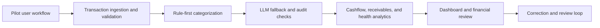

# FlowFinance Public Product Evidence

This page records the product and pilot claims that can be defended publicly.
It does not disclose customer identities, transaction data, private URLs,
credentials, or partner materials.

## Live Product

- Public URL: https://www.flowfinancebusiness.com
- Product: financial intelligence and workflow analytics for MSMEs
- Venture role: Co-Founder
- Resume period: January 2026 to July 2026

## Deployment Evidence

The deployed environment used the following AWS services:

- EC2 for application compute
- RDS for the managed relational database
- VPC for network isolation
- Secrets Manager for application credentials

The public claim is limited to those services. This repository contains no
credentials, account identifiers, private network configuration, or billing
details.

## Data Provenance

The 81,813-record corpus is a combination of anonymized real records and
generated records used for workflow testing across 28 categories. It must not
be described as 81,813 production customer transactions.

The public repository does not contain the underlying transaction corpus. Any
demo data should be synthetic and clearly labeled.

## Pilot Evidence

- 10+ MSMEs participated in one-month free pilots.
- 10+ returned after their initial use for another financial review.
- These organizations were pilots, not paid customers.
- FlowFinance generated no revenue during the stated period.
- Customer names and valuations are intentionally omitted.

## Product Architecture

## Strategy Model Boundary

TAM/SAM/SOM, pricing, CAC, LTV, payback, and partner-API economics in this
repository are modeled decision assumptions. They are not historical revenue
or audited operating results. Sensitivity files and risk registers are
provided so those assumptions can be challenged explicitly.

## Interview-Safe Summary

FlowFinance demonstrates product ownership, cloud deployment, data workflow
design, analytics, pilot acquisition, and market-entry work. The strongest
honest outcome is repeat pilot use, not revenue. Any future claim of paid
conversion or commercial revenue should be added only after it occurs and can
be documented.
